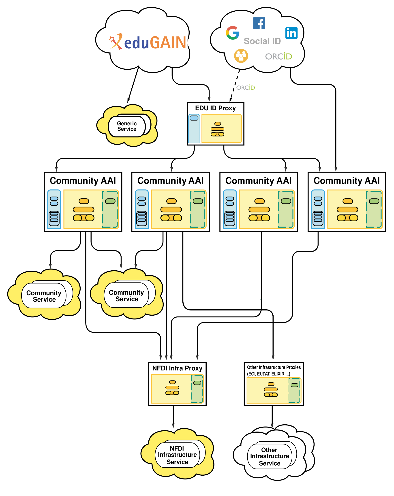



# Architecture

## Introduction

The NFDI Architecture supports the
[AARC-Blueprint-Architecture](https://aarc-community.org/architecture/) (proxy model) and
[AARC-BPA-2019](https://aarc-community.org/guidelines/aarc-g045/) (which splits
"Community AAI" and "Infrastructure-Proxy").

The Architecture enables:

- **Users** (from DFN AAI, eduGAIN, ORCID, Google, etc., ...) to
    authenticate to NFDI services that may be integrated at different
    levels of the architecture, depending on the requirements and scope of
    the service.

- **Communities** (e.g. an NFDI-Consortium) to manage group memberships to
    organise access rights.

- **Service Owners** to
    - easily integrate their services
    - authorise on a well defined set of attributes

## Architecture Diagram

The diagram of the architecture looks quite complex. It is described
below, and should (will) become clearer.

Note, that the architecture makes no assumption which protocols are being
used between the different entities. In principle SAML and OpenID Connect
(OIDC) are possible in each step. In practice academic identities and
existing services use SAML, while commercial providers (e.g. google,
microsoft) and other services use OIDC.

X.509 user-certificates may also be used at different places, but there is
a general trend to deprecate them (for user authentication).

{: style="width:700px"}

!!! info

    **NFDI Services may be connected at three different layers in the architecture**

    - Services connected directly to the Home-IdPs (in eduGAIN, or any
    subset of it, such as DFN AAI) are called **Generic Service**. These
    do not receive any Community related attributes, and are accessible
    without the need to use a Community-AAI. Consequently, generic
    services cannot access Community Specific attributes, such as VO
    memberships and the community identifier.  Migrating a generic
    service to the Community AAI is a major change, since the attribute
    sets released by Home-IdPs and those released by Community-AAIs may
    differ substantially.
    - Services connected to a Community AAI are called **Community
    Service**. They obtain the attribute set described in the
    [attributes](attributes.md) section, including VO membership or
    Resource Entitlements (see [Authorisation](authorisation.md) Section).
    Community Services are typically accessible by a single community only.
    - Services connected to the Infrastructure Proxy **Infrastructure
    Service**. They obtain the same attribute set as Community Services,
    and can therefore be migrated very easily. Infrastructure services are
    accessible by all Communities (i.e. if the appropriate
    [authorisation](authorisation.md) criteria are met).

## Architecture Components

The details of the Architecture Components are defined in the [2019 version
of the AARC Blueprint Architecture](https://aarc-community.org/guidelines/aarc-g045/).
We repeat the core aspects here.

### Identity Providers

Identity providers (IdPs) are defined as the place where the user ultimately
authenticates. This may be by using a password, a certificate, involve a
2nd factor, etc.

Different Identity providers have different identity qualities, expressed
as levels of assurance using the [REFEDS Assurance Framework
(RAF)](https://refeds.org/assurance).

### edu-ID Proxy

The edu-ID system will provide a life-long persistent ID to researchers, even if they use
different Home Identity Providers. Some details for the use of the edu-ID
proxy are still under development, as such its use is currently optional,
but its place in the architecture is already fixed.
Furthermore, it can be used for account linking and as a central Guest/Homeless IdP.
For more information, please refer to [the documentation](https://doku.tid.dfn.de/de:aai:eduid:start). 

### Community AAI

Community AAIs are web platforms that allow a community (e.g. an
NFDI-Consortium) to manage themselves. This includes in particular VO and
group memberships, and applies to all attributes about a user, including
persistent identifiers.

The available software products to run the NFDI Community AAI Architecture
are [described here in more detail](community-aai-software.md).

### NFDI Infrastructure Proxy

There will be a single infrastructure proxy, operated by the AAI Team.
This proxy component requires substantial development which is planned to
be carried out within the upcoming Base4NFDI project.

The infrastructure proxy serves multiple purposes:

1. Simplify the connection of NFDI services (i.e. such services that
   serve more than a single Community). All services connected to the
   Infrastructure Proxy will immediately be able to consume
    - Users from eduGAIN, ORCID, and Social Providers (Google, ...)
    - VO membership information from the Community AAI through wich a user
        authenticated

1. Authorisation. Some services may not be able to understand the
   authorisation attributes, or to act accordingly. For such services
   (that should be an exception) the Infrastructure Proxy may be
   configured to take the authorisation decision for the service (i.e. by
   not redirecting an unauthorised user to that service).

1. Identity Linking. Some users have multiple identities. This may be
   intentional or not. Causes may be that either different Community AAIs
   are used between subsequent logins, or that the Home-IdP or a "Social"
   IdP is used in different logins. The Infrastruture Proxy may combine
   these logins which are then presented as a consistent single identity
   to the service.

   Addressing this in conjunction with the NFDI requirements will be part
   of the developments in Base4NFDI.

### NFDI Community AA

The Community AA (Attribute Authority) is planned for administration of
NFDI internal rights. This component still needs to be developed and is
not intended for general public usage.


